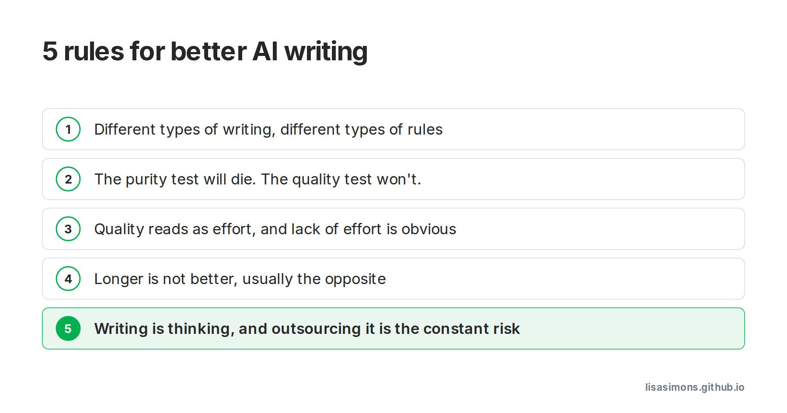

AI Buzzwords: AI Writing.

I enjoy listening to [The AI Daily Brief](https://aidailybrief.ai/). It doesn’t feel like homework. 
The ‘5 rules for better ai writing’ episode was particularly interesting to me as a BA.

Rule 5 has always been my reasoning behind writing documents that no one wants to read.

My other solution is creating diagrams (pictures) as much as possible instead of text. 

I do wonder what the AI approach to model diagrams is?

[Link to The Daily Brief](https://aidailybrief.ai/e/2026-08-26).

#learningaboutai #aiwriting