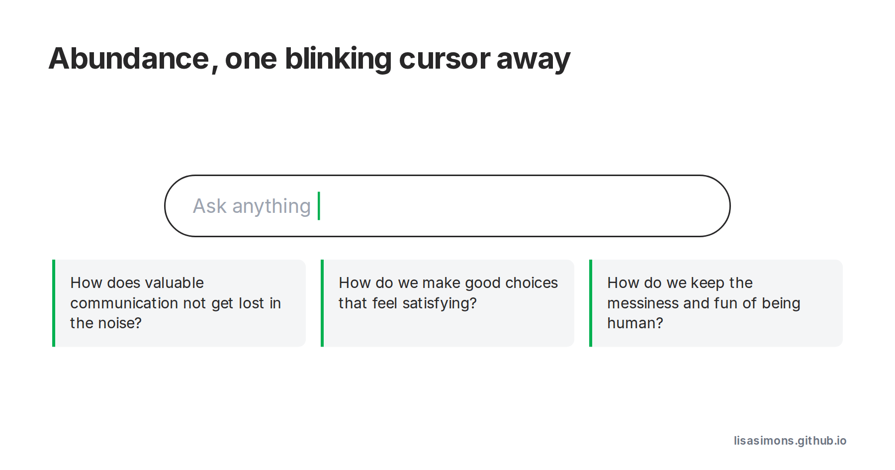

🐝 AI Buzzwords: Abundance. The infinite backlog. Opportunity AI.

The “blinking cursor” symbolises for me the abundance of information and capabilities that are now at our fingertips (or voice command).

With this abundance, comes challenges. 

Reading [this Psychology Today article](https://www.psychologytoday.com/au/blog/the-digital-self/202509/ai-and-the-abundance-bubble) by [John Nosta](https://www.linkedin.com/in/johnnosta) made me realise how important it is to have methods to deal with this overwhelming onslaught of information.

> How do we make sure important, valuable communication doesn’t get lost in the noise?

> Given the “Paradox of Choice”, how do we make good choices that feel satisfying?

> With the tempting ease of AI generation, how do we enable the innovation, and ingenuity, and the sheer wonderful messiness, and FUN of being human?
