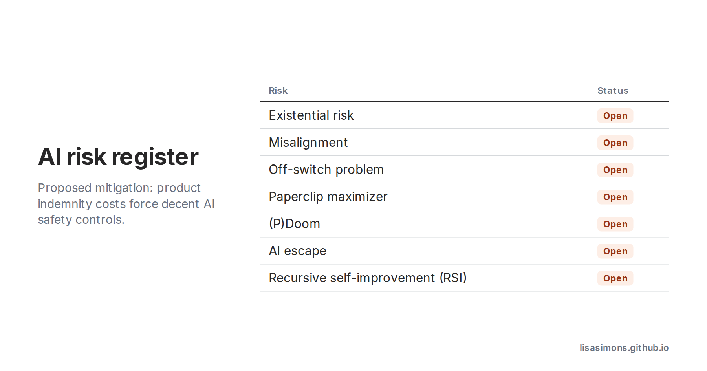

AI buzzwords: Existential Risk. Misalignment. Off-Switch Problem. Paperclip Maximizer. (P)Doom. AI Escape. Recursive Self-Improvement (RSI). Frontier.

After [Dario Amodei's](https://www.linkedin.com/in/dario-amodei-b5b8a3267) essay, "We Must Pace the Frontier", 
and Jacob Coxon being in the news for quitting Anthropic saying people in the industry "earnestly believe that it could kill us all by the end of the decade", and 
'The AI Doc' on Netflix,...  
... let's just say I'm not feeling the joy of AI at the moment.

Personally I'm hoping that 'product indemnity' costs, and the sheer number of billionaires will save humanity by forcing decent AI safety controls to be put in place - once they've lost enough money themselves when AI "escapes". 

Certainly I'm not betting on human ethics, cooperation or common sense being the reason we survive.

[Link to We Must Pace the Frontier](https://darioamodei.com/post/we-must-pace-the-frontier)

[The AI Doc](https://www.imdb.com/title/tt39150120/)

#learningaboutai #aibuzzwords
