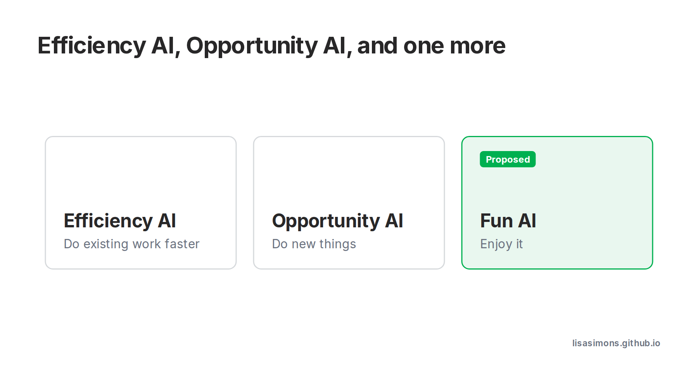

AI buzzwords: Efficiency AI, Opportunity AI.

There is already: Efficiency AI and Opportunity AI. 

I propose a new buzzword: Fun AI.

  <iframe src="https://www.youtube-nocookie.com/embed/b34vwOWLDXI"
    title="YouTube video" style="position:absolute;inset:0;width:100%;height:100%;border:0;border-radius:8px"
    allow="accelerometer; clipboard-write; encrypted-media; gyroscope; picture-in-picture" allowfullscreen></iframe>

#aibuzzwords

