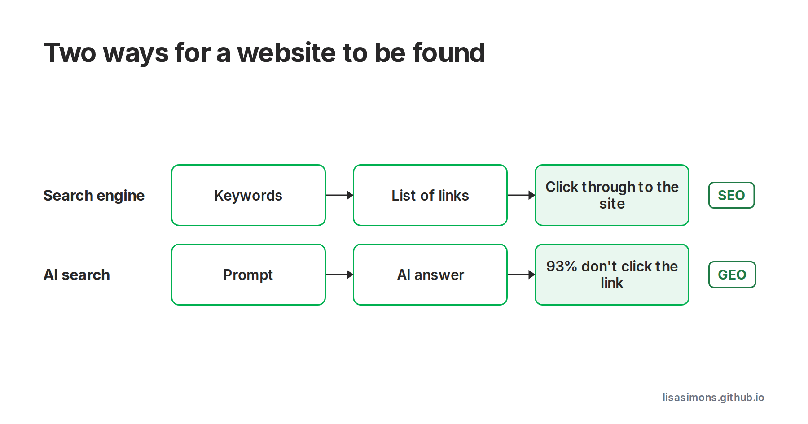

AI buzzwords: Consumer AI. GEO. Semantic search. Agent-assisted buying.

I did a detour into the whole concept of there now being 2 types of website searches. Websites can now appear in:
1. Traditional search engine results (built around keywords), and
2. AI answers to prompts (“semantic searches”).

One suggested activity for website owners, is to conduct regular “GEO Audits”. It’s kind of fun.  
| Who is Lisa Simons?  
I tried entering likely questions from potential customers into each AI search app - Google AI mode, Claude Grok, ChatGPT and Copilot (no Perplexity or Muse yet) – and what came out each time was so interesting.

The challenge is how to make your website appear in the AI answers to questions your potential customers may ask.

The same SEO rules apply to GEO, but for GEO there is no visibility on AI Search traffic, and no visibility on what terms are being used for AI Searches.

The most common suggestions for GEO seem to be so far:
- Add “answer-led content” (such as reference guides),
- Earning credibility is important (citations and backlinks from reputable sites),
- Unique content can be a “moat” (create something worth linking to), and
- Of course, ask your AI to help.

Related ideas that I kind of knew, but didnt think about the implications of:
- Bot traffic is now higher than human traffic -> So page structure, schema markup and content should be easy for AI to interpret, but not wreck the human experience.
- Zero-click searches. If the AI response has the answer, 93% of readers don’t click on the link to the site. -> So how does this impact the sales funnel?
- The words I enter in an AI prompt are different to what I enter into a search engine. -> I’ve been a Keyword Engineer for many years. 😊

[Luminary's WTF is GEO guide](https://www.luminary.com/blog/generative-engine-optimisation-geo-guide)

#learningaboutai #aibuzzwords
