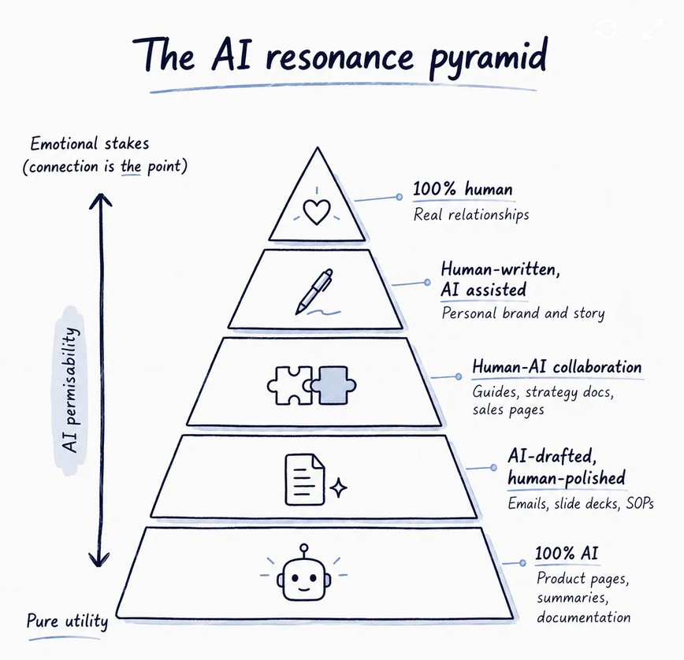

I’m working on improving my understanding of AI.

In [Tayla Burrell‘s](https://www.linkedin.com/in/taylaburrell/) post [How to use AI without destroying your credibility (according to psychology)](https://taylaburrell.substack.com/p/how-to-use-ai-without-giving-your?utm_campaign=post-expanded-share&utm_medium=web)
Law 2 has this "AI Resonance Pyramid", which I reckon is a good model for when AI writing is permissible.  

It explains the controversy around Druckenmiller’s obviously AI written op ed.

#learningaboutai #aiwriting

