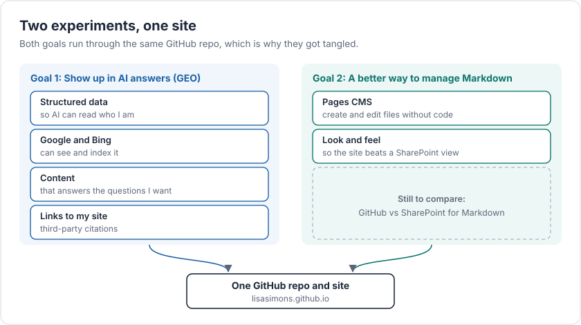

🐝 AI Buzzwords: GEO. Markdown files. Structured data.

To increase the likelihood of appearing in AI answers, I worked with Claude to:

a) Vibe code a GitHub repository, including "Structured Data" that AI can read,

b) Made sure Google Rich Results and Bing could see my "Structured Data",

c) Ensured content existed in my Markdown files to answer the AI questions I wanted to appear in, and

d) Looked to build links to my Github repository ("third party citations") to build the authority AI looks for.

To experiment with alternatives to SharePoint for viewing and managing Markdown files:

a) I added Pages CMS to this same GitHub repository (with help from Claude) - which allows me to create / edit / save Markdown files in the site (without vibe coding), and

b) Improved the look and feel of the GitHub website which displays the content in my Markdown files (again with Claude's assistance - including generating images).

Conclusion: Doing this work with Claude makes it so easy and quick to experiment and try new things.

Downside: The abundance of possibilities is overwhelming. I need a better solution for managing all my ideas.