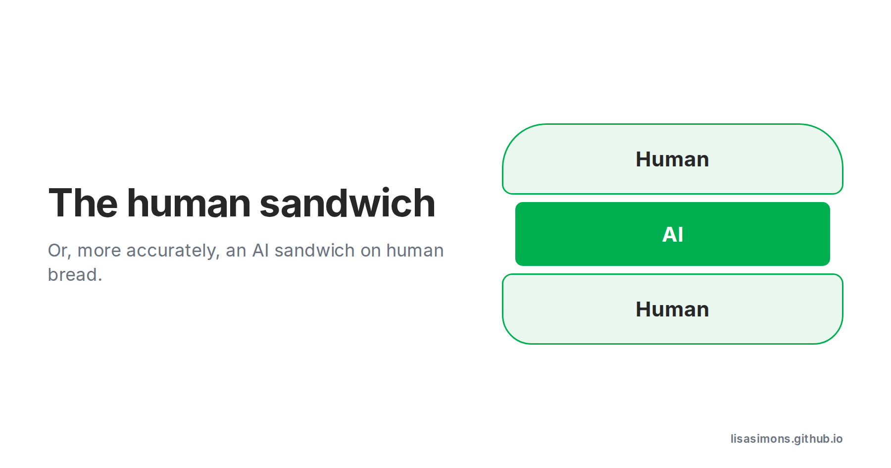

AI Buzzwords: Human Sandwich.

Part of the agenda behind my AI reading is trying to anticipate the risks, and how to mitigate them. Will there will be a job apocalypse?

But I’m also loving the buzzwords. Especially buzzwords that suggest there is hope for us humans v AI.

Today’s buzzword is "human sandwich" - taken from [this article](https://every.to/p/after-automation) from Every’s CEO, Dan Shipper.

What I like about this buzzword is that it is a simple model for how humans work with AI, and it implies there is still going to be work for humans.

What I don’t like is that it is a misnomer, and really it should be an “AI sandwich” on “human bread”. Not as catchy, but I am an analyst.

PS. I like the Human | Agent button at the bottom of the Every window.

#learningaboutai #aibuzzwords 
