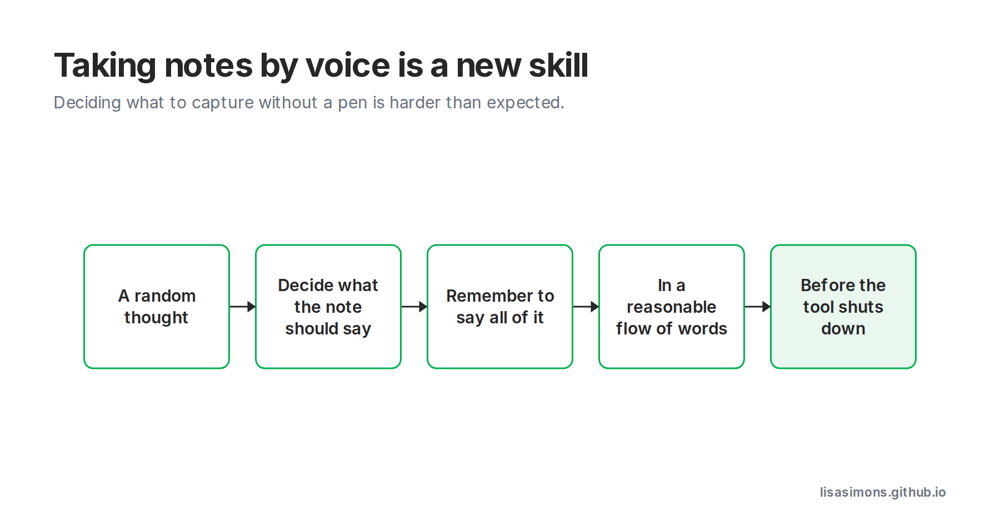

AI Buzzwords: AI Dictation.

What really struck me in this week’s [GPT-6 Astra video](https://www.youtube.com/watch?si=JKvPG03dQB0fWkNz&v=1QNsdr-Qx_I&feature=youtu.be) was everyone giving verbal instructions.

  <iframe src="https://www.youtube-nocookie.com/embed/1QNsdr-Qx"
    title="YouTube video" style="position:absolute;inset:0;width:100%;height:100%;border:0;border-radius:8px"
    allow="accelerometer; clipboard-write; encrypted-media; gyroscope; picture-in-picture" allowfullscreen></iframe>

Coincidentally this week I’ve made the leap into using dictation technology to take notes, and I’m kind of shocked at the cognitive effort required.

I’ve realised as an analyst I’ve always taken written notes and drawn diagrams. So much of my thinking is visual.

Deciding what idea I want to capture without a pen is harder than I expected. 

Going from a random thought or podcast idea… to deciding what the note should say…. to remembering to say all of it…. in a reasonable flow of words… fast enough that the tool doesn’t shut down…. is a new skill I’m still learning.

#learningaboutai #aibuzzwords
