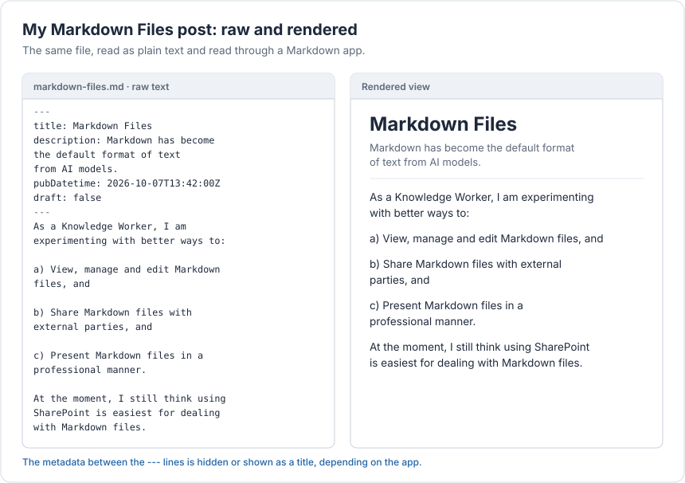

I know there is a small risk that the Markdown files trend will end. I'm no expert so I don't really know.

For now anyway, I think as a Knowledge Worker, I need to explore what options are available to: 

a) View, manage and edit Markdown files, and 

b) Share Markdown files with external parties, and 

c) Present Markdown files in a professional manner. 

At the moment, I still think using SharePoint is easiest for dealing with Markdown files.

