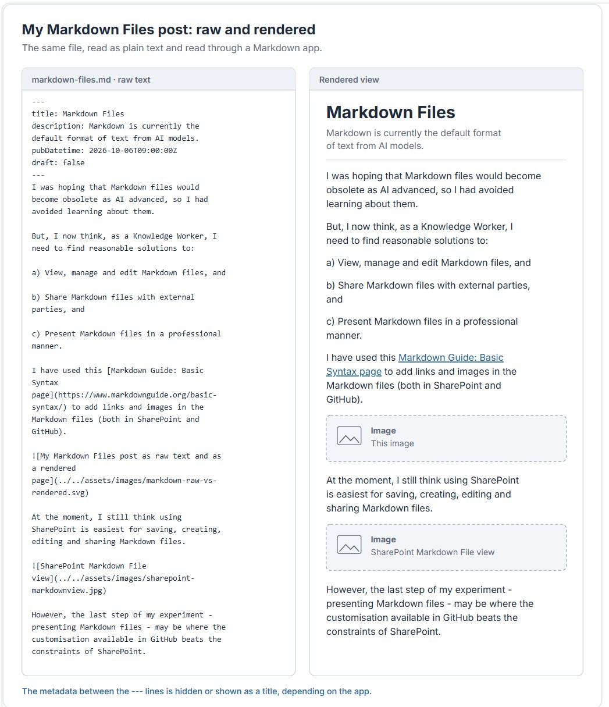
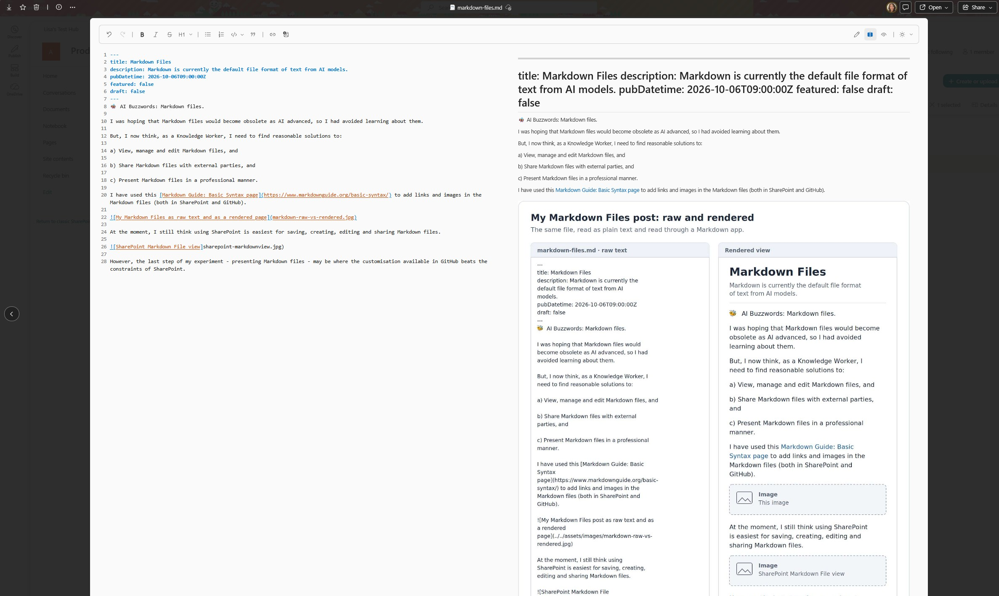

🐝 AI Buzzwords: Markdown files.

I was hoping that Markdown files would become obsolete as AI advanced, so I had avoided learning about them.

But, I now think, as a Knowledge Worker, I need to find reasonable solutions to: 

a) View, manage and edit Markdown files, and 

b) Share Markdown files with external parties, and 

c) Present Markdown files in a professional manner. 

I have used this [Markdown Guide: Basic Syntax page](https://www.markdownguide.org/basic-syntax/) to add links and images in the Markdown files (both in SharePoint and GitHub).

At the moment, I still think using SharePoint is easiest for saving, creating, editing and sharing Markdown files.

However, the last step of my experiment - presenting Markdown files - may be where the customisation available in GitHub beats the constraints of SharePoint.