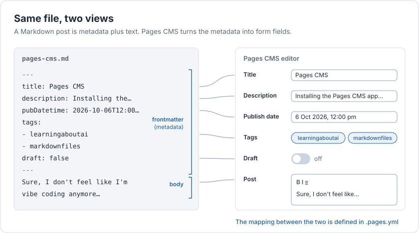
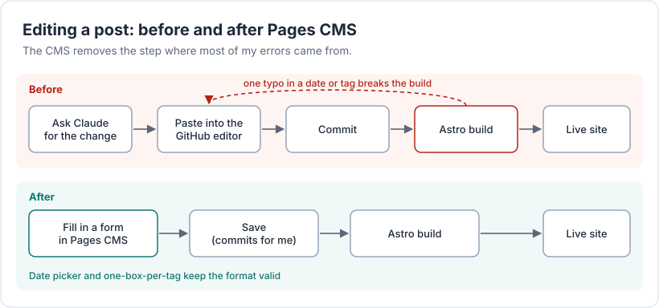
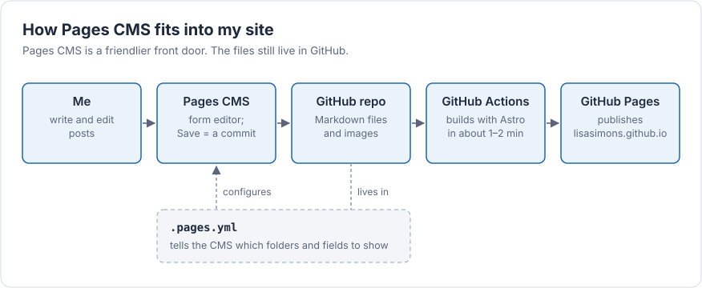

Today I installed the Pages CMS on my GitHub repository, which meant I was able to:

- See all my content posts in nice folders (i.e. without all the website coding folders and files),
- Edit the content in a nice UI (no more vibe coding!), and

- Click Save to publish/edit the content to the website (i.e. commit in GitHub).

I still consider this part of my AI learning exercise, as I couldn’t have setup the Pages CMS without AI.

For example, I needed Claude to help me setup the `.pages.yml` file in my GitHub repository. 

Since getting Pages CMS working, I have found myself still switching between GitHub, Pages CMS and Claude, as I play around with the settings. 

Claude continues to help me out whenever I break things.