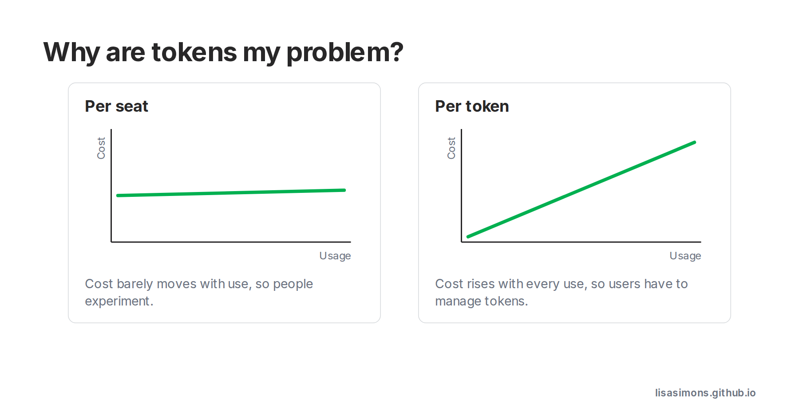

AI Buzzwords: Tokens.

Pricing models are interesting in terms of their unintended consequences on user behaviour. 

This article from [GTMnow](https://www.linkedin.com/company/gtmnow/posts/?feedView=all) got me wondering - why is token usage a problem the user has to solve? Worrying about tokens feels like worrying about the electricity usage of my desktop. Imagine if desktops were priced per kwh.

It was this paragraph from the article that got me thinking about AI pricing models:
> In classic SaaS, a common pricing model was per seat, […] It barely moves whether someone logs in once a month or a thousand times. That’s why software runs at 80-90% gross margin. 

Flat fee / per seat pricing encourages experimentation. But it does also depend how many humans are left with seats.

This article has lots of good suggestions for token management. But - really - when tokens are so cheap, why are tokens my problem? 

[Link to GTMNow article](https://thegtmnewsletter.substack.com/p/ai-token-price-collapse-costs-rising?utm_source=substack&utm_medium=email&utm_content=share)

#learningaboutai #aibuzzwords